1. Perfilado y Optimización de Rendimiento:

- Profiler:

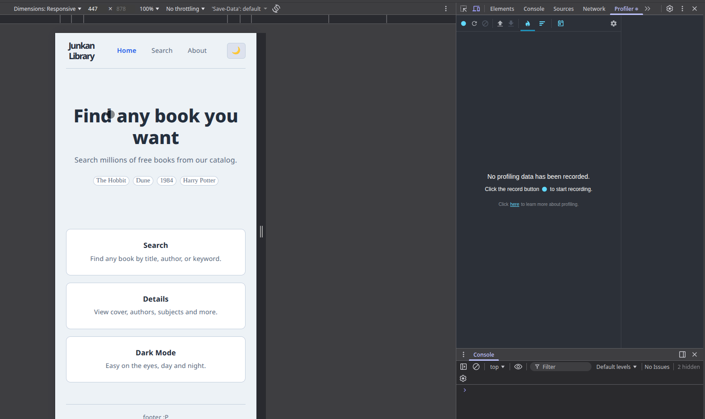

Componentes:

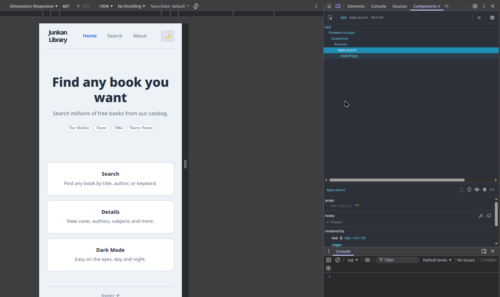

He pensado en qué componente necesitaría optimización, definitivamente sería el de busqueda de libros. cuando se busca lo mismo dos veces y cuando se cambia de ventana se hace la busqueda dos veces, sería bueno que, por ejemplo, al cambiar de home a search, esté cacheado la lista de libros anterior

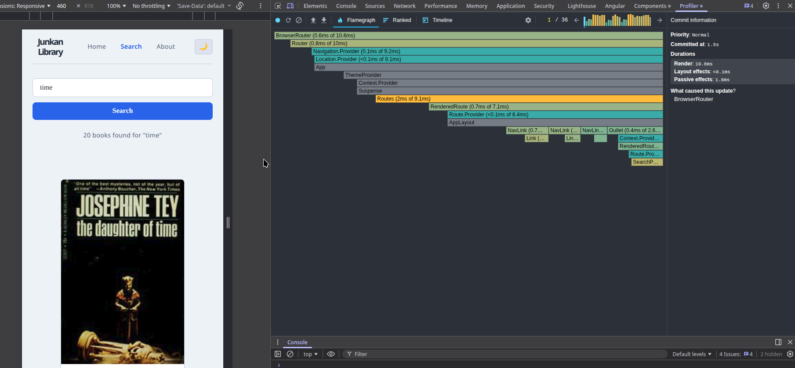

La causa de todos estos re-renders es que la query y books vivien en el componente, entonces cualquier cambio en la query, hace trigger de todo el arbol debajo, (muchos libros, rerender pesado e innecesario)

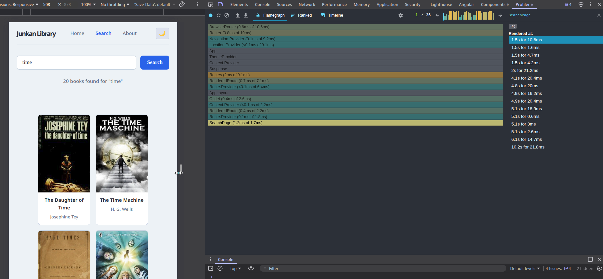

En esta screenshot, no hice ninguna busqueda, solo escribí en la query cosas distintas, y react renderizaba todo el componente, innecesariamente

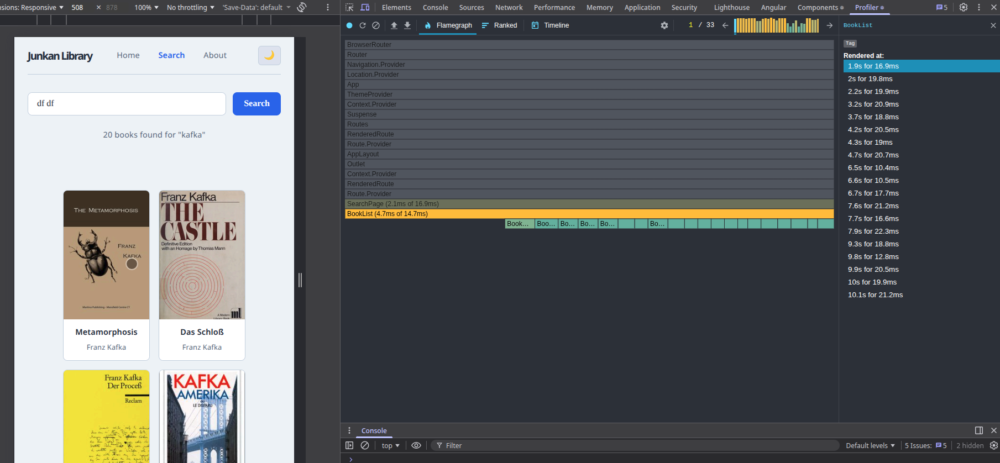

- Profiler después - solución

he utilizado memo para bookList y bookcard, 

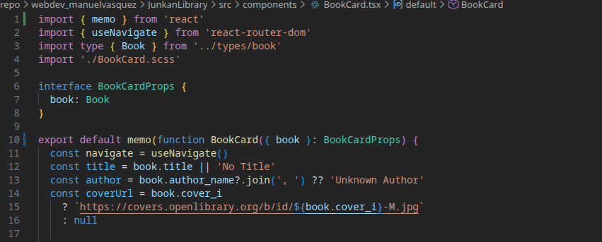

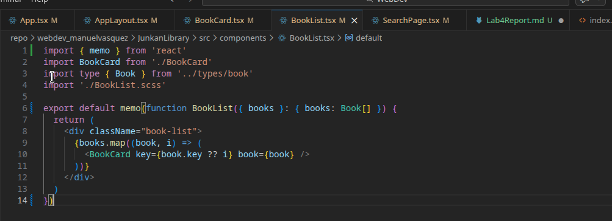

memo wrappea el componentes y le dice a react que solo le haga re-render si es que los props cambiaron, entonces la lista sigue intacta mientras que el usuario escribe en la query lo que quiera.

Funciona perfectamente con Redux también, porque el input de la query y los resultados ahora son estados distintos.
Escribir hace update a query pero no cambia books, entonces BookList no encuentra ningún cambio en las props y hace skips del re-render de todo el componente, que sería innecesario.

Ahora ya no hace el re-render innecesario al cambiar el query search

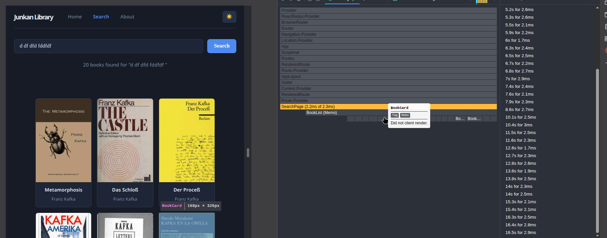

theme:

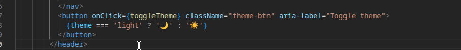

ahora: 

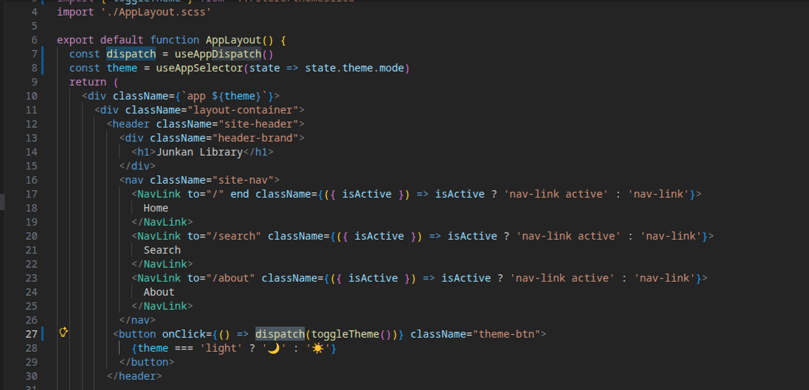

3. State Refactoring - OPCIÓN A, USO DE REDUX
Referencias, documentación (genera, uso de thunks)
https://redux.js.org/tutorials/fundamentals/part-3-state-actions-reducers
https://redux.js.org/usage/writing-logic-thunks

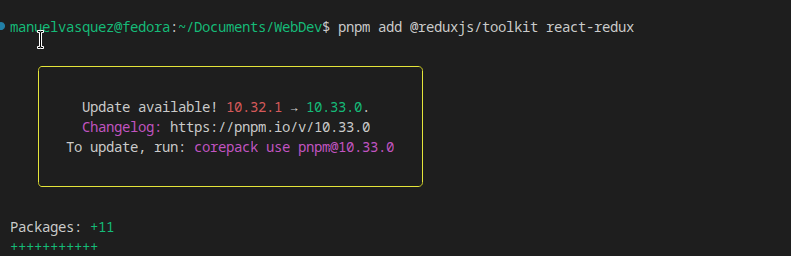

Redux, antes del refactor, el estado de la busqueda vivia dentro de SearchPage, utilizando useState

Ahora themeSlice maneja el tema, y searchSlice maneja la query, book, isLoading y error
La llamada en sí se hace con createAsyncThunk, (un thunk es algo que hace un trabajo aparte) el componente hace dispatch del fetchBooks(query) y lee el resultado de la store, no sabe ni le importa cómo funciona el fgetch

theme slice

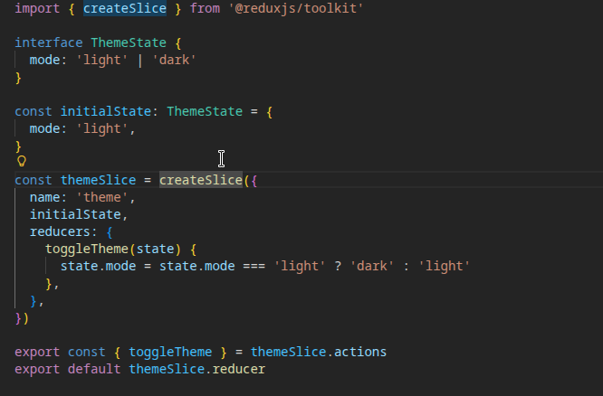

Los slices guardan todo lo relacionado a la feature, con un estado inicial. createSlice genera las acciones para los reducers (no como en angular que tenía que hacerse más manualmente)

ThemeSlice guarda unicamente light y dark.

SearchSlice utiliza AsyncThunk (que es una acción asyncrona simplemente) redux lo corre en pending, fulfilled y rejected. se manejan en extraReducers y actualizo dependiendo de ello el isLoading, Books y error como se hacía en el useState anteriormente.

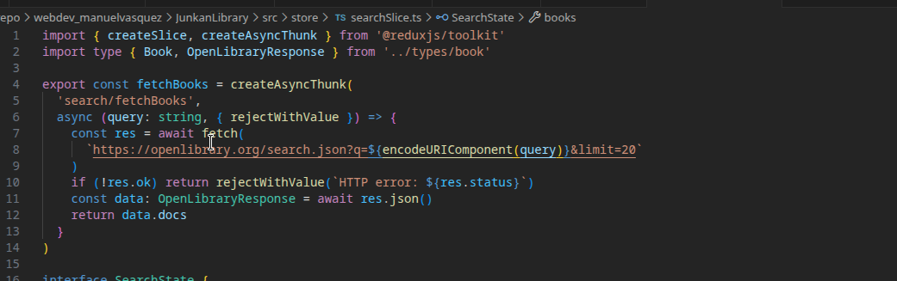

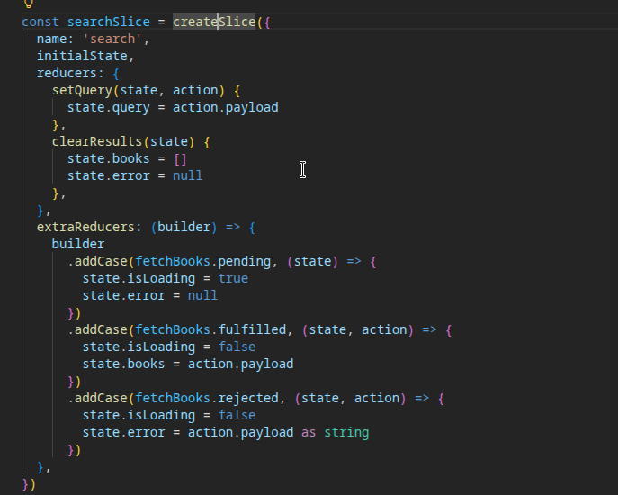

Para usarlos en los componentes, useAppSelector lee el estado del store por ejemplo state.search.books o state.theme.mode — y useAppDispatch te da la función para despachar acciones. Cuando un componente despacha fetchBooks(query), Redux corre el thunk, el fetch sale a la red, y cuando vuelve actualiza el store. Todos los componentes que estén leyendo ese pedazo del store se re-renderizan automáticamente con los datos nuevos.

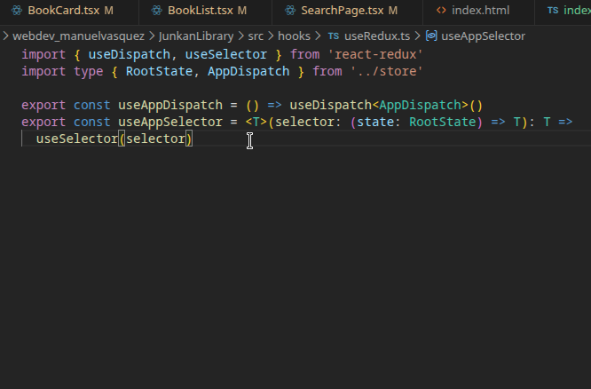

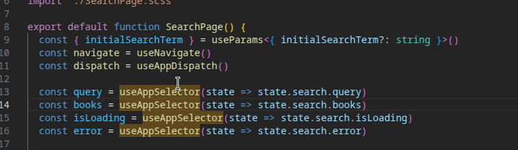

Libros gif:

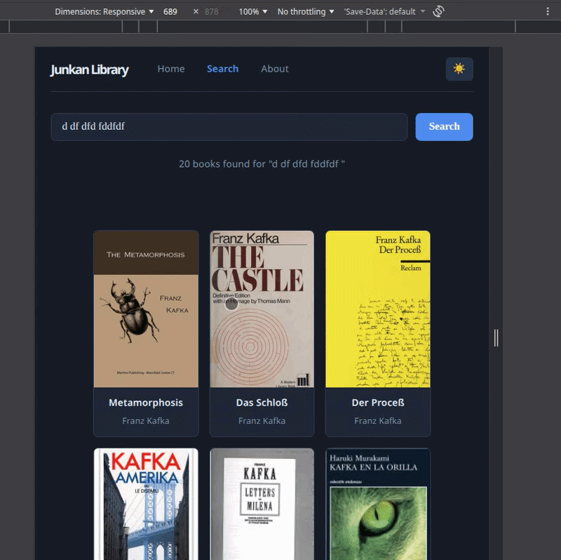

Ahora el estado sobrevive a la navegación del a appweb, por lo que al cambiar de pestañas, la busqueda seguirá ahí

Redux dev tools

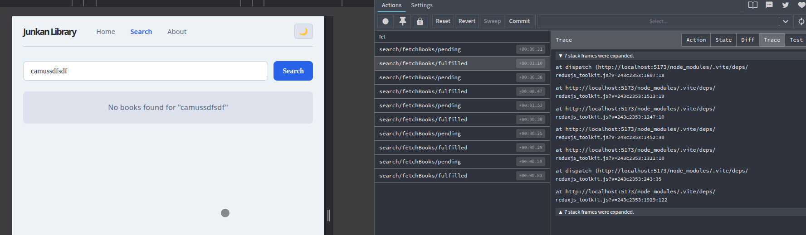

SetQuery se lanza en cada cambio de teclas, pero solo luego de hacer submit se lanza los fetchbooks y el fetchBooks/fullfilled

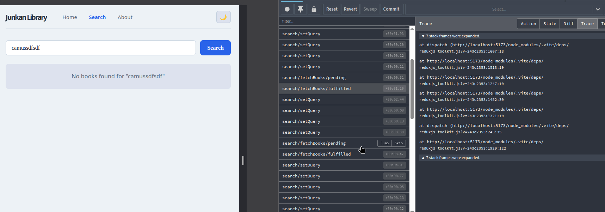

