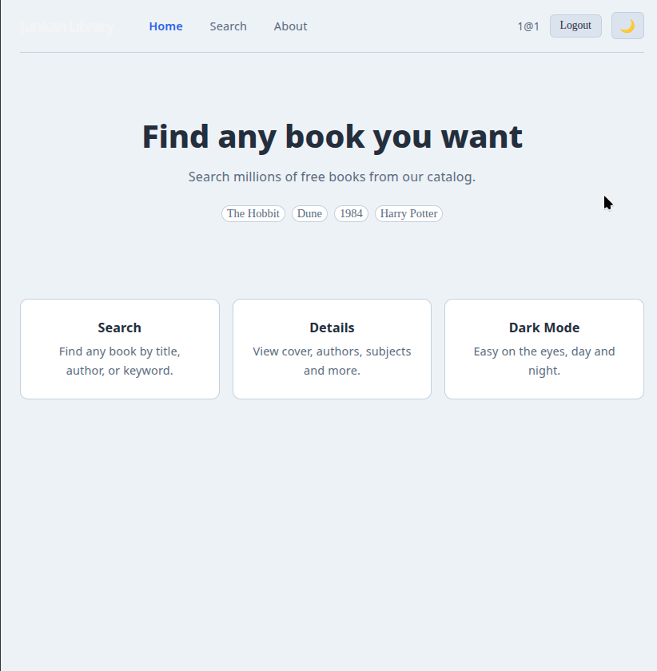
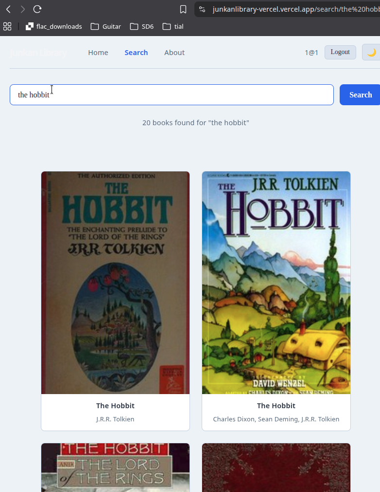
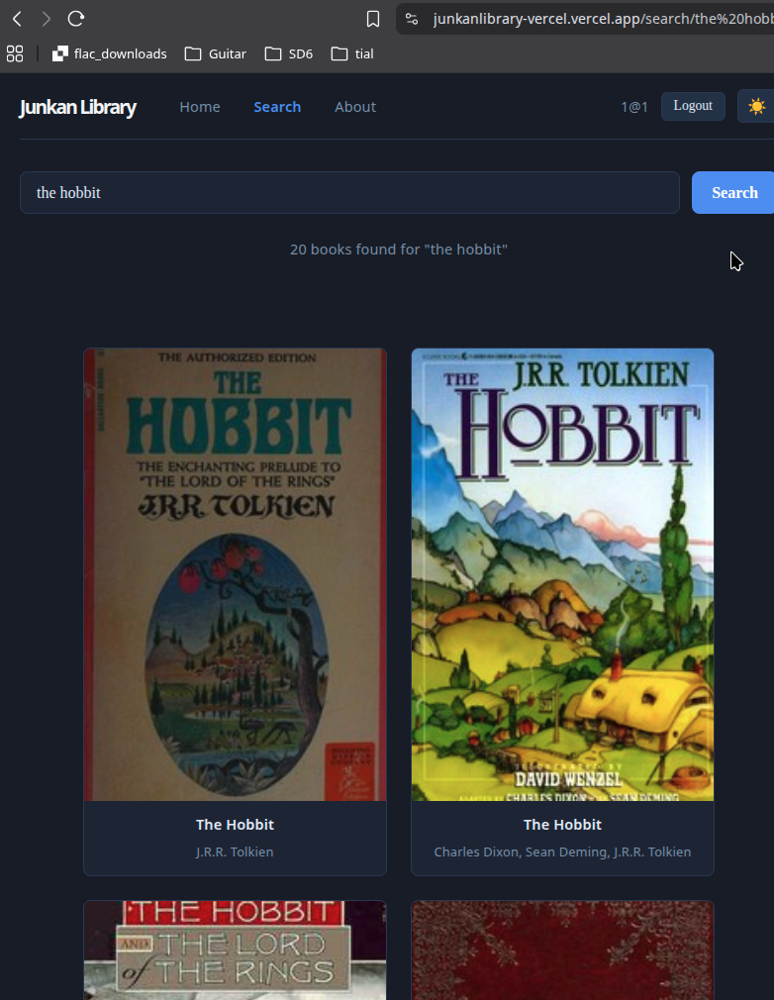

# Junkan Library

A book search app built with React, TypeScript, SCSS and Redux Toolkit. Search for any book using the Open Library API, view details, and switch between light and dark themes. Authentication is handled by a separate ASP.NET Core backend.

**Live app:** https://junkanlibrary-vercel.vercel.app

---

## Screenshots

<!-- Screenshot: home page -->

<!-- Screenshot: search results -->

<!-- Screenshot: dark mode -->

---

## Tech Stack

- React 19 + TypeScript
- Redux Toolkit — global state management
- React Router v6 — routing and navigation
- SCSS — styling with CSS variables for theming
- Vitest + React Testing Library — unit and integration tests
- Vite — build tool
- ASP.NET Core (JunkanBackend) — authentication API

---

## Features

- Search millions of books via the Open Library API
- Book detail pages with cover, description and subjects
- Light and dark theme toggle, persisted across routes
- User registration and login with JWT authentication
- Protected routes — search and detail pages require login
- Search state persists when navigating between pages
- Lazy loaded routes for faster initial load
- 13 unit and integration tests

---

## Live Links

| | URL |
|---|---|
| Frontend | https://junkanlibrary-vercel.vercel.app |
| Backend | https://junkanbackend-production.up.railway.app |
| Backend repo | https://github.com/your-username/JunkanBackend |

---

## Project Structure

```
src/
├── store/
│   ├── index.ts            — Redux store
│   ├── authSlice.ts        — login, register, logout
│   ├── searchSlice.ts      — search query and results
│   └── themeSlice.ts       — light/dark mode
├── hooks/
│   ├── useFetch.ts         — generic data fetching hook
│   └── useRedux.ts         — typed useAppSelector / useAppDispatch
├── context/
│   ├── ThemeContext.ts
│   ├── ThemeProvider.tsx
│   └── useTheme.ts
├── components/
│   ├── AppLayout.tsx       — shared layout with nav bar
│   ├── BookCard.tsx
│   ├── BookList.tsx
│   └── ProtectedRoute.tsx  — redirects to /login if no token
├── pages/
│   ├── HomePage.tsx
│   ├── SearchPage.tsx
│   ├── LoginPage.tsx
│   ├── RegisterPage.tsx
│   ├── BookDetailPage.tsx
│   └── AboutPage.tsx
└── test/
    ├── setup.ts
    └── testUtils.tsx       — shared Redux + Router wrapper for tests
```

---

## Routing

| Path | Page | Auth required |
|---|---|---|
| `/` | Home | No |
| `/login` | Login | No |
| `/register` | Register | No |
| `/about` | About | No |
| `/search` | Search | Yes |
| `/search/:initialSearchTerm` | Search with pre-filled query | Yes |
| `/books/:bookId` | Book detail | Yes |

---

## Getting Started

### Prerequisites

- Node.js 18 or higher
- pnpm
- The JunkanBackend API running (see below)

### Installation

```bash
git clone https://github.com/SrJunken/JunkanLibrary.git
cd JunkanLibrary
pnpm install
```

### Environment variables

Create a `.env` file in the root of the project:

```
VITE_API_URL=http://localhost:5000
```

For production this is set as an environment variable in Vercel pointing to the Railway backend URL.

### Run in development

```bash
pnpm run dev
```

Open http://localhost:5173 in your browser.

### Run tests

```bash
pnpm test
```

### Build for production

```bash
pnpm build
```

---

## Backend Setup (JunkanBackend)

The backend is a separate ASP.NET Core minimal API that handles authentication.

```bash
git clone https://github.com/SrJunken/JunkanBackend.git
cd JunkanBackend
dotnet restore
dotnet run
```

The API runs on http://localhost:5000 by default.

**Required environment variables for production (Railway):**

```
Jwt__Key=your-long-secret-key
Jwt__Issuer=junkan-api
Jwt__Audience=junkan-client
Jwt__ExpiryMinutes=60
ASPNETCORE_URLS=http://+:8080
```

**Endpoints:**

| Method | Path | Description | Auth |
|---|---|---|---|
| POST | `/auth/register` | Create a new user | No |
| POST | `/auth/login` | Returns a JWT token | No |
| GET | `/me` | Returns current user info | Yes |

---

## Authentication Flow

1. User submits email and password on LoginPage
2. Frontend dispatches the `login` thunk — POSTs to `/auth/login`
3. Backend verifies the password hash with BCrypt and returns a signed JWT
4. Token is saved in the Redux store and in `localStorage`
5. Protected routes check `state.auth.token` via `ProtectedRoute`
6. Logout clears the token from the store and `localStorage`

---

## Tests

13 tests total, written with Vitest and React Testing Library. `fetch` is mocked with `vi.fn()` so no real network calls are made.

| File | Tests |
|---|---|
| `LoginPage.test.tsx` | form renders, redirects on success, shows error on bad credentials |
| `ProtectedRoute.test.tsx` | renders children with token, redirects without token |
| `BookCard.test.tsx` | shows title/author, cover image, emoji fallback, navigates on click |
| `useFetch.test.ts` | loading state, success, HTTP error, null URL, network failure |

---

## API

Open Library — free public API, no authentication required.

- Search: `https://openlibrary.org/search.json?q={query}&limit=20`
- Book detail: `https://openlibrary.org/works/{bookId}.json`
- Covers: `https://covers.openlibrary.org/b/id/{coverId}-M.jpg`

---

## License

MIT