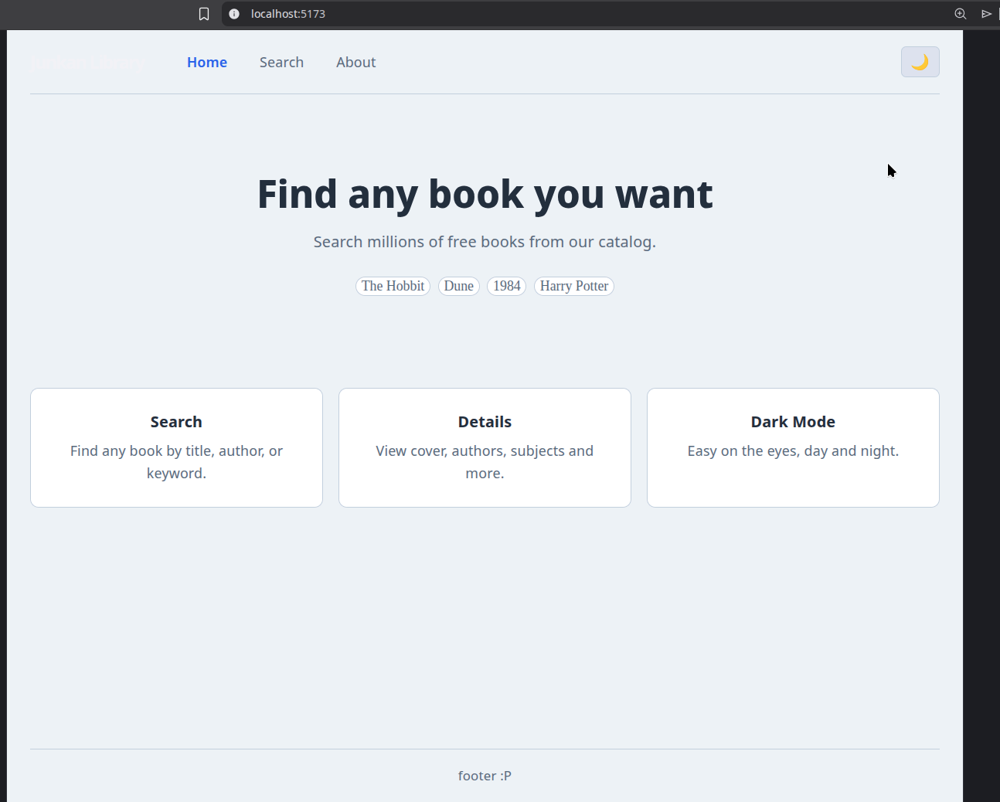
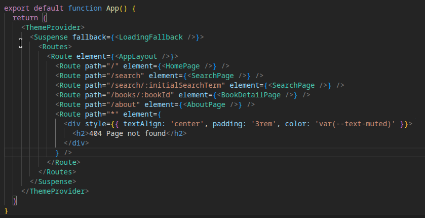
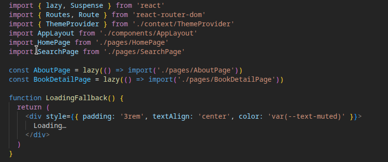
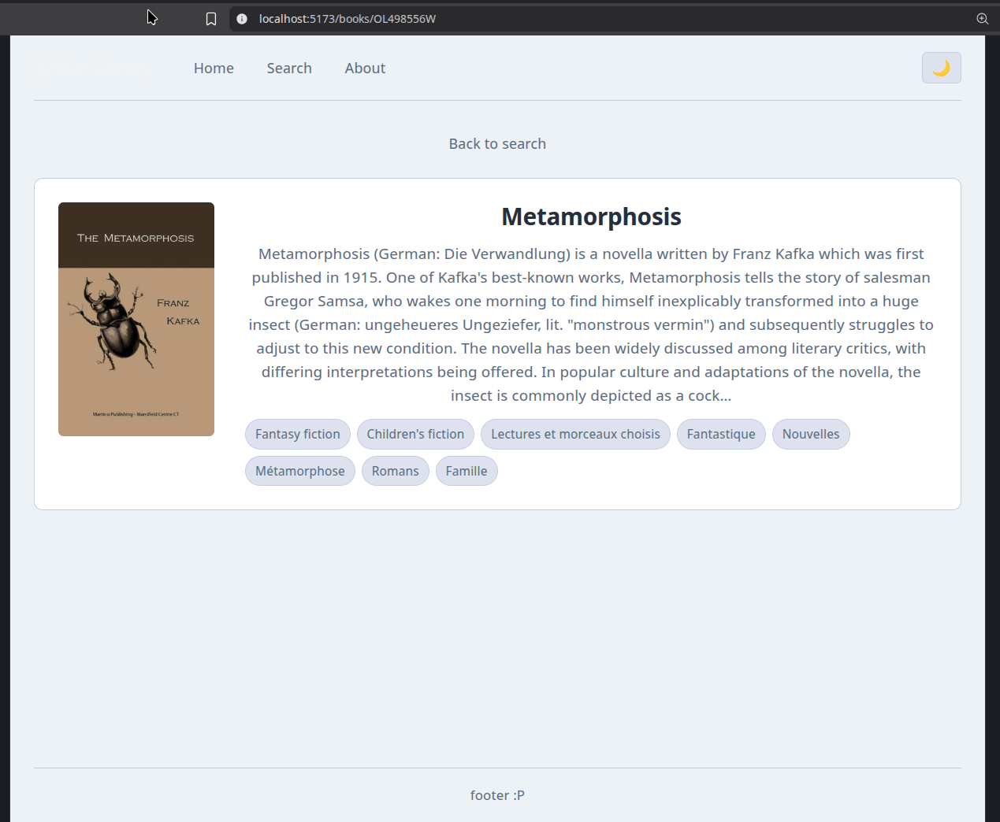
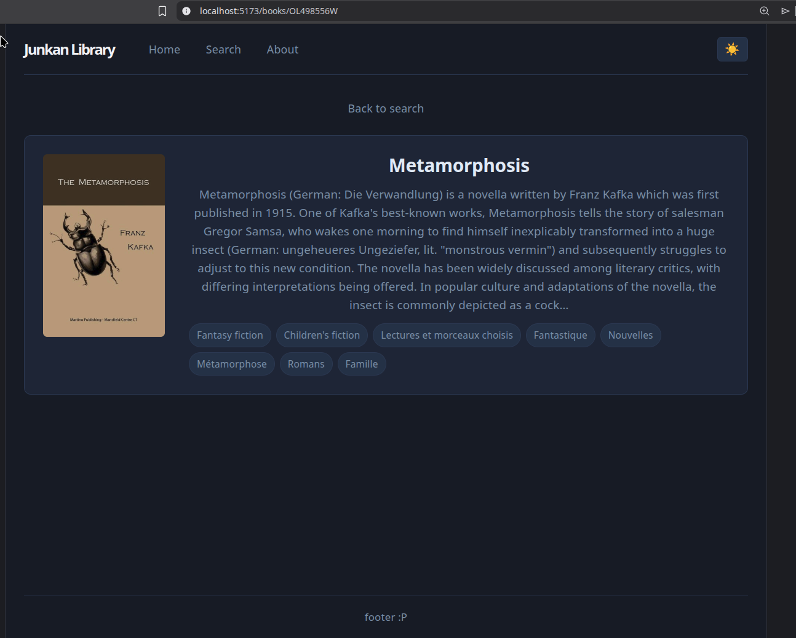
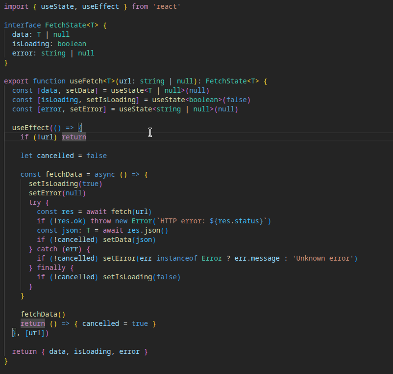

# Book Dashboard - React Application

A simple book search dashboard built with React, TypeScript, and SCSS. Search for books using the OpenLibrary API, view results in a responsive grid, and switch between light and dark themes.

---




---

## How to Run

Prerequisites: Node.js 18 or higher and pnpm (or npm).

```bash
pnpm install
pnpm run dev
```

Open http://localhost:5173 in your browser. If you don't have pnpm, use `npm install` and `npm run dev` instead.

---

## Project Structure

The project is now organized into pages, components, context, and hooks:

- `src/components/AppLayout.tsx`: shared layout with the navigation bar, rendered on every page using React Router's `<Outlet />`.
- `src/components/BookCard.tsx`: displays a single book with cover, title, and author. Clicking it navigates to the detail page.
- `src/components/BookList.tsx`: renders a grid of BookCard components.
- `src/pages/HomePage.tsx`: landing page with a short description and quick-search chips.
- `src/pages/SearchPage.tsx`: search form and results list. Keeps the search term in the URL.
- `src/pages/BookDetailPage.tsx`: shows full details for a single book, loaded from the URL parameter.
- `src/pages/AboutPage.tsx`: project information page. Loaded lazily for code splitting.
- `src/context/ThemeContext.ts`: defines the context object and its types.
- `src/context/ThemeProvider.tsx`: holds the theme state and exposes `toggleTheme` to the rest of the app.
- `src/context/useTheme.ts` custom hook to consume the theme context from any component.
- `src/hooks/useFetch.ts`: generic data-fetching hook used by SearchPage and BookDetailPage.
- `src/types/`: TypeScript interfaces for book data.

---

## Routing

The app uses React Router v6 with a nested route structure. `AppLayout` is the parent route and wraps all pages, so the navigation bar is always visible. The routes are:

| Path | Page | Notes |
|---|---|---|
| `/` | HomePage | Landing page |
| `/search` | SearchPage | Book search |
| `/search/:initialSearchTerm` | SearchPage | Search with pre-filled query from URL |
| `/books/:bookId` | BookDetailPage | Dynamic route — `bookId` maps to an Open Library work ID |
| `/about` | AboutPage | Lazy loaded |







The dynamic route `/books/:bookId` receives the work ID as a URL parameter (for example `/books/OL45804W`) and fetches the book details from the API using that value.

http://localhost:5173/books/OL498556W



---

## State Management — ThemeContext

Theme state (light/dark) is managed globally with React Context so any page can read or toggle it without prop drilling. The logic is split across three files: `ThemeContext.ts` creates the context, `ThemeProvider.tsx` wraps the app and holds the state, and `useTheme.ts` is the hook used to consume it. The root `App.tsx` wraps everything inside `<ThemeProvider>`.



---

## Custom Hook — useFetch

`useFetch<T>(url)` is a generic hook that accepts a URL string and returns `{ data, isLoading, error }`. It handles the fetch, loading state, and error catching internally. Passing `null` as the URL skips the fetch entirely, which is useful when a search term is empty. Both `SearchPage` and `BookDetailPage` use this hook instead of writing fetch logic directly in the component.




---

## Performance — Lazy Loading

`AboutPage` and `BookDetailPage` are imported with `React.lazy()` in `App.tsx`. This means their code is split into separate bundles and only downloaded by the browser when the user navigates to those routes for the first time.

```tsx
const AboutPage = lazy(() => import('./pages/AboutPage'))
const BookDetailPage = lazy(() => import('./pages/BookDetailPage'))
```

---

## Previous Parts

Components and Props (Part 1)
`SearchContainer` passes the `books` array down to `BookList` via props. `BookList` maps through it and renders a `BookCard` for each entry. Data flows unidirectionally from parent to child.

State and Events (Part 2)
`SearchBar` uses `useState` to manage its input as a controlled component. On submit, it calls `e.preventDefault()`, validates the input, passes the value up to the parent via `onSearch`, and clears itself.

Side Effects and Rendering (Part 3)
`SearchContainer` used `useEffect` to fetch from the OpenLibrary API whenever `searchTerm` changed. That logic has been moved into the `useFetch` hook but works the same way: loading state is set before the fetch, cleared after, and the UI renders conditionally based on the current state.

---

## API Used

OpenLibrary — public API, no authentication required.

Search: `https://openlibrary.org/search.json?q={query}&limit=20`

Book detail: `https://openlibrary.org/works/{bookId}.json`

Covers: `https://covers.openlibrary.org/b/id/{coverId}-M.jpg`